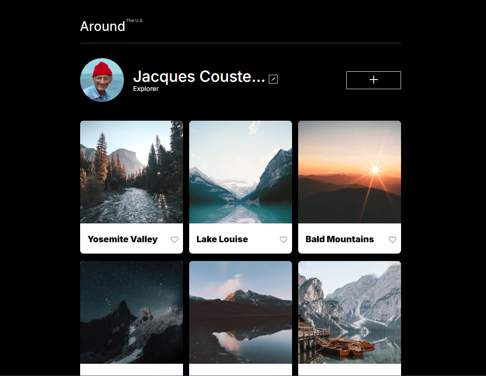
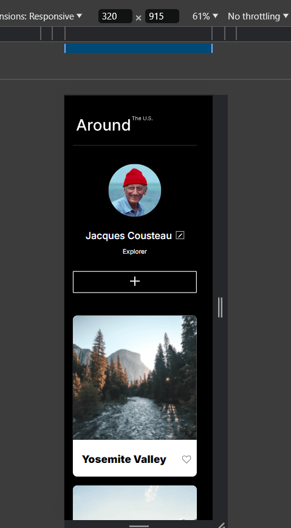

[Link to the website](https://rosayi0702.github.io/se_project_aroundtheus/)

Video of this project: https://www.youtube.com/watch?v=7InrT5MnxVk

# Project 3: Around The U.S.

**Intro**

_Around the U.S._ is a website that displays beautiful photos taken by Jacques Cousteau.
It is a webside that will adjust how it displays based on whether the users are using the website (1280 viewport) or mobile (320 viewport).
This project is made so all the elements are displayed correctly on popular screen sizes. We recommend investing more time in completing this project, since it's more difficult than previous ones.

**Figma**

- [Link to the project on Figma](https://www.figma.com/file/ii4xxsJ0ghevUOcssTlHZv/Sprint-3%3A-Around-the-US?node-id=0%3A1)

**Techniques**

- Flex & Grid
- Font installation
- Text-overflow
- Media queries

**Images**

